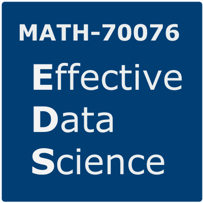
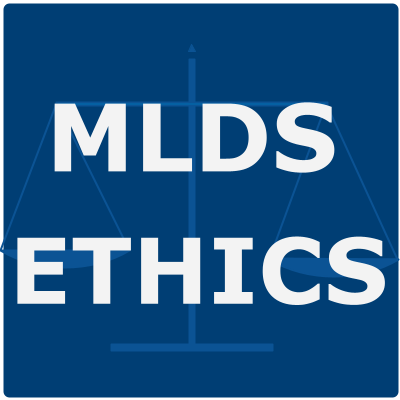
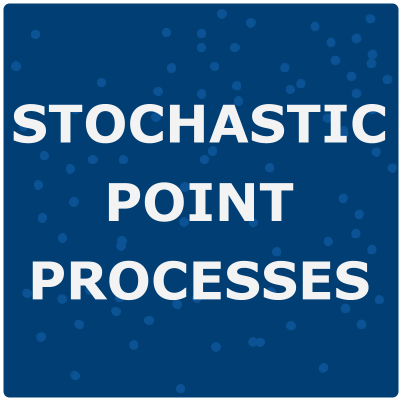
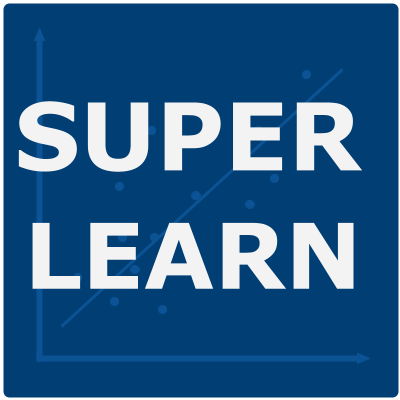
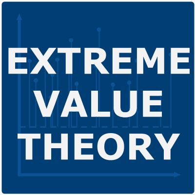

---
format:
  html:
    toc: false
---
# Teaching

I am fortunate to have had the opportunity to teach in a variety of roles. These have included:

- Developing and teaching modules in statistics, data science and data ethics.

- Designing courses for both in-person and remote learning, predominantly at the postgraduate level.

- Supervising undergraduate, postgraduate and doctoral research projects. 

- Adapting and leading short courses on scientific writing and communication.

- Running workshops and computer labs for undergraduate and postgraduate modules.

- Speaking at university open days and providing one-to-one tuition to high school students.

I am a [Fellow of the Higher Education Academy](https://www.advance-he.ac.uk/fellowship/fellowship), which acknowledges my commitment to enhancing the quality, effectiveness, and accessibility of my teaching activities. I achieve this through reflection, learning from others, and engaging with educational research. I am a co-founder and organiser of the [Mathematics Teaching Seminar](https://imperialcollegelondon.github.io/maths-teaching-seminar/) at Imperial College London, which aims to promote collaborative, innovative and evidence-based approaches to mathematics education.

## My Courses

### Effective Data Science 

::: small_right

:::

<a href="https://eds-notes.zakvarty.com" class="btn btn-outline-primary m-1" target="_blank"> Notes</a>
<!-- -->
<a href="https://youtube.com/playlist?list=PLBVD-YN3U17AiyuMwW77yGnVuqbS8tdtq&si=Rw-LY5xz7BVdeSkn" target="_blank" rel="noopener noreferrer" class="btn btn-outline-primary m-1"> Videos</a> 
<!-- -->
<a href="https://github.com/zakvarty/effective-data-science-resources" class="btn btn-outline-primary m-1" target="_blank"> Resources</a>

Model building and evaluation are necessary but not sufficient skills for the effective practice of data science. In this module you will develop the technical and personal skills that are required to work successfully as a data scientist within an organisation.

During this module you will critically explore how to:

- effectively scope and manage a data science project; 
- work openly and reproducibly;
- efficiently acquire, manipulate, and present data;
- interpret and explain your work for a variety of stakeholders;
- ensure that your work can be put into production; 
- assess the ethical implications of your work as a data scientist.

This interdisciplinary course draws from fields including statistics, computing, management science and data ethics. Each topic will is investigated through a selection of lecture videos, conference presentations and academic papers, supported by hands-on lab exercises and readings on industry best-practices as published by recognised professional bodies. 

### Ethical Machine Learning and Data Science 

::: small_right

:::

<a href="https://www.zakvarty.com/ethics-reading-list.html" class="btn btn-outline-primary m-1" target="_blank"> Reading List</a>
<!-- -->
<a href="https://github.com/zakvarty/ethics-one-resources" class="btn btn-outline-primary m-1" target="_blank"> Part 1</a>
<!-- -->
<a href="https://github.com/zakvarty/ethics-two-resources" class="btn btn-outline-primary m-1" target="_blank"> Part 2</a>
<!-- -->
<a href="https://github.com/zakvarty/ethics-three-resources" class="btn btn-outline-primary m-1" target="_blank"> Part 3</a>

Data-driven decision making is now pervasive and impacts us all. Your  data is used by others to make decisions about who you are, how you  will behave, and what options should be made available to you.  Predictive models are used to decide anything from the promotions that are offered to you by a retailer through to whether your loan application is granted by a bank. 

The ways in which these predictive models can fail _mathematically_ form a core part of the training for an aspiring statistician, data  scientist or machine learning practitioner. In contrast, the potential for _ethical_ failures in these same models is rarely covered in-depth as part of this initial training. As a result, these  ethical modes of failure are often not considered until those predictive  models have been put into production and are actively causing harm.

To prevent this harm, the ethical impacts of using data to make  decisions must be made core to the curriculum of both statistics and  data science. This course aims to address that gap.

The course takes a practical and technical approach to identifying these ethical issues. It has a strong mathematical focus and will not  not require the authoring of extended essays or moral treaties. Throughout the course, you will discover actionable ways in which these topics may  be integrated into a data science workflow at a range of levels.

### First Year Research Project: Stochastic Point Processes

::: small_right

:::

<a href="https://m1r.zakvarty.com" class="btn btn-outline-primary m-1" target="_blank"> Notes</a>

Course materials to guide a first exploration of stochastic point processes. 

We will have four sessions, each focusing in on one aspect of stochastic point processes: theory, simulation, inference and applications. The materials for these sessions focus mainly on the Poisson process in one dimension, which considered both as a special example of a stochastic process and also as a statistical model for point pattern data. We will explore this simple model together and I will point you in the direction of interesting areas to further explore for yourself.

These materials were created as a starting point for undergraduate research projects at Imperial College London. The intended reader is an undergraduate student at the end of their first year of study, who is familiar with the basics of probability and statistical inference and has some programming experience. The materials might also be useful to anyone with a similar background who is learning about point process models for the first time.

### Supervised Learning 

::: small_right

:::

<a href="https://youtube.com/playlist?list=PLBVD-YN3U17BybIN_6drVs9LLmw7f_XvN&si=MmP6KAWvIMxgFhwc" target="_blank" rel="noopener noreferrer" class="btn btn-outline-primary m-1"> Videos</a>

This course introduces the framework of supervised learning with an emphasis on principled and uncertainty-aware modelling. (It is a stats course after all!)

We discuss both classical and modern approaches to regression and classification problems, along with issues that arise when working with flexible non-parametric models. We start with a review of the linear modelling framework for regression and classification problems before extending this class of models, first to generalized linear models and then generalised additive models. Following this, we consider a range of modern non-parametric alternatives, discussing both their benefits and drawbacks. 

Throughout the course, we will evaluate and compare the performance of these models on datasets from a variety of scientific problem domains. 

<!--
1. Select an appropriate supervised learning method for a given application
2. Use statistical models to extract information from processed data 
3. Design pipelines taking raw data as input and producing conclusions in context as output
4. Interpret the output of statistical models in plain language
5. Use suitable diagnostic tools to recognise common modes of failure of supervised learning algorithms  
-->

### Extreme Value Theory

::: small_right

:::

<a href="https://extremes-notes.zakvarty.com" class="btn btn-outline-primary m-1" target="_blank"> Notes</a>
<!-- -->
<a href="https://youtube.com/playlist?list=PLBVD-YN3U17Ce7tO3bkJqgJT_JrgkFgA5&si=C0fKsAtUmEV2KlTS" target="_blank" rel="noopener noreferrer" class="btn btn-outline-primary m-1"> Videos</a> 

The majority of approaches in statistics and data science aim to learn about the "typical" levels of a process. In some cases though, we really want to understand those outcomes that are unusually large or small. We might want to understand when the weakest link in a chain will break, to predict record-breaking athletic performances or to describe the size and frequency of the largest financial losses. 

To answer these questions we must extrapolate beyond the range of observed outcomes. This can be a risky business and requires careful, domain-specific considerations. Extreme value theory gives us a principled, mathematically motivated framework for modelling the largest (or smallest) values within a dataset. 

This course will introduce you to a formal strategy for modelling the tails of random variables. We will develop this modelling framework based on an area of probability theory that is rarely studied at undergraduate level, paying close attention to the issues that come with using such asymptotically motivated models. We will see how techniques from standard statistical inference can be adapted into this modelling framework and apply it to a range of examples from finance and the environmental sciences.

## Teaching Statistics Resources

### Groups 

- [Teaching Statistics Section](https://rss.org.uk/membership/rss-groups-and-committees/sections/teaching-statistics) of the Royal Statistical Society
- [Consortium for the Advancement of Undergraduate Statistics Education](https://causeweb.org/cause) (CAUSE)
- [Burwalls](https://sites.google.com/view/burwalls/home)
- [The Teaching Statistics Trust](https://teachingstatisticstrust.org.uk/) 
- [Researchers of Statistics Education Network](https://rose-network.org) (RoSE)
- [Teaching and Learning Mathematics Online](https://talmo.uk/) (TALMO)

### Journals 

- [Teaching Statistics](https://onlinelibrary.wiley.com/journal/14679639)
- [Journal of Statistics and Data Science Education](https://www.tandfonline.com/journals/ujse21)
- [Statistics Education Research Journal](https://iase-pub.org/ojs/SERJ)
- [Technology Innovations in Statistics Education](https://escholarship.org/uc/tise/aboutus)
